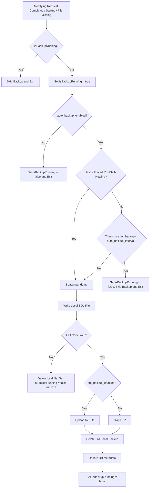

# Backup & Restore System Audit Report

This document details the audit of the current database backup, restore, and query architecture of the application. It serves as the baseline before implementing any modifications to the backup trigger mechanism.

---

## 1. Current Backup Architecture

### Entry Points
* **Manual Backup Entry Point**: Triggered via `GET /api/backup/manual`. This route calls `backupController.manualBackup`, which invokes `backupService.streamManualBackup(res)`.
* **Automatic Backup Entry Point**:
  1. **Write-Request Middleware**: Located in [app.js](file:///c:/Users/moksh/Videos/Projects/HP%20Factory/NP-Frontend/server/app.js#L14-L26). It listens to the `finish` event of Express responses and triggers `backupService.triggerAutoBackup()` on successful (`2xx`) `POST`, `PUT`, or `DELETE` requests that do not target `/api/backup`.
  2. **Server Startup**: Triggered in [app.js](file:///c:/Users/moksh/Videos/Projects/HP%20Factory/NP-Frontend/server/app.js#L29-L31) on application launch.
  3. **Missing File Self-Healing**: Triggered in [backupService.js](file:///c:/Users/moksh/Videos/Projects/HP%20Factory/NP-Frontend/server/services/backupService.js#L29-L51) inside `getSettings()`. If auto-backup is enabled but the last backup file is missing from local disk, a fresh backup is triggered in the background.

### Core Architecture & Implementation
* **Shared Backup Functions**: Located in the [backupService](file:///c:/Users/moksh/Videos/Projects/HP%20Factory/NP-Frontend/server/services/backupService.js) object.
* **Backup File Generation**: Achieved by spawning PostgreSQL's native `pg_dump` utility as a child process using Node's `spawn`.
* **pg_dump Commands & Flags**:
  * **Manual Backup**: 
    ```bash
    pg_dump -U [DB_USER] -h [DB_HOST] -p [DB_PORT] [DB_NAME]
    ```
    *(Note: Does not clean tables; output is streamed directly to client).*
  * **Automatic Backup**: 
    ```bash
    pg_dump -U [DB_USER] -h [DB_HOST] -p [DB_PORT] --clean [DB_NAME]
    ```
    *(Note: Uses the `--clean` flag to output commands to DROP tables before recreating them).*
  * **Environment Configuration**: Both commands pass `PGPASSWORD=[DB_PASSWORD]` via the child process environment variables (`env`) to avoid prompt locks.
* **Backup File Format**: Plain-text SQL file format.
* **Local Backup Behavior**: Pipes `pg_dump`'s stdout stream directly to a local file stream created at `[auto_backup_path]/AutoBackup-[timestamp].sql`.
* **FTP Backup Behavior**: If `ftp_backup_enabled` is true, the local backup file is uploaded via `basic-ftp` client to the remote FTP server.
* **FTP Streaming**: Does not stream directly. The backup is fully written to the local disk first, then uploaded using `client.uploadFrom()`.
* **Backup Filename Generation**:
  * **Manual**: `ManualBackup-YYYY-MM-DD--HH-mm-ss.sql` (UTC based string replacements).
  * **Auto**: `AutoBackup-DD-MM-YYYY--HH-mm-ss.sql` (Local time via `toLocaleString('en-GB')`).
* **Temporary File Handling**:
  * **Manual**: Streamed directly; no local temporary file is created.
  * **Auto**: Streamed directly to its final local destination. If the backup fails (non-zero process exit), the incomplete file is deleted via `fs.unlinkSync()`.
  * **Restore**: The uploaded file is saved to `uploads/backups/`. It is immediately deleted via `fs.unlinkSync()` after the restore finishes (regardless of success or failure).
* **Backup Validation**: Checks if the `pg_dump` child process exited with status code `0`.
* **Error Handling**: Non-zero exit code unlinks the partial backup file and logs the error. FTP upload failures are caught, logged, and ignored without failing the database metadata registration.
* **Logging**: Standard stdout/stderr logging via `console.log` and `console.error`.

---

### Manual vs. Automatic Backup Complete Flows

```mermaid
sequenceDiagram
    autonumber
    actor User as Client / Middleware
    participant Srv as Express Server
    participant DB as PostgreSQL DB
    participant Local as Local Disk
    participant FTP as FTP Server

    rect rgb(20, 20, 40)
    note right of User: Manual Backup Flow
    User->>Srv: GET /api/backup/manual
    Srv->>Srv: Check isBackupRunning
    alt Already running
        Srv-->>User: 429 Too Many Requests
    else Idle
        Srv->>Srv: Set isBackupRunning = true
        Srv->>Srv: Set Content-Disposition Attachment
        Srv->>DB: Spawn pg_dump (stdout)
        DB-->>Srv: SQL Dump Stream
        Srv-->>User: Stream file download chunk-by-chunk
        Srv->>Srv: Set isBackupRunning = false
    end
    end

    rect rgb(20, 40, 20)
    note right of User: Automatic Backup Flow
    User->>Srv: Database mutating request completes (2xx status)
    Srv->>Srv: Check isBackupRunning
    alt Already running
        Srv->>Srv: Log "Skipping auto-backup: process running" & Exit
    else Idle
        Srv->>Srv: Set isBackupRunning = true
        Srv->>DB: Query backup_settings
        DB-->>Srv: Return settings
        alt Auto-backup disabled
            Srv->>Srv: Set isBackupRunning = false & Exit
        else Enabled
            Srv->>Srv: Check File Existence & Throttle Interval
            alt Within interval AND file exists
                Srv->>Srv: Set isBackupRunning = false, log skipped & Exit
            else Out of interval OR file missing (Self-Healing)
                Srv->>DB: Spawn pg_dump --clean
                DB->>Local: Write to AutoBackup-[timestamp].sql
                alt Success (Exit 0)
                    Srv->>FTP: Upload file (if FTP enabled)
                    Srv->>Local: Delete old last_backup_file
                    Srv->>DB: UPDATE backup_settings metadata
                    Srv->>Srv: Set isBackupRunning = false
                else Fail (Exit !== 0)
                    Srv->>Local: Delete partial file
                    Srv->>Srv: Set isBackupRunning = false
                end
            end
        end
    end
    end
```



---

## 2. Current Automatic Backup Trigger

The automatic backup mechanism is currently triggered by three conditions:
1. **The write-request middleware** in [app.js](file:///c:/Users/moksh/Videos/Projects/HP%20Factory/NP-Frontend/server/app.js#L14-L26) intercepts all successful API mutations.
2. **Server startup** in [app.js](file:///c:/Users/moksh/Videos/Projects/HP%20Factory/NP-Frontend/server/app.js#L29-L31) triggers a backup immediately.
3. **Database settings retrieval** in [backupService.js](file:///c:/Users/moksh/Videos/Projects/HP%20Factory/NP-Frontend/server/services/backupService.js#L29-L51) checks if the target file physically exists. If missing, it initiates a background backup.

### Trigger Logic Decision Flow


---

## 3. Database Query Architecture

* **Database Connection Client**: Configured in [db.js](file:///c:/Users/moksh/Videos/Projects/HP%20Factory/NP-Frontend/server/config/db.js).
* **Pool System**: Uses a single instance of `pg.Pool`.
* **Query Wrappers**:
  * `db.query(text, params)`: Runs queries directly against the pool. It intercepts database error code `42P01` (undefined table) to trigger the background auto-healing mechanism (`dbHealer.autoHealDatabase(pool)`), then throws the error.
  * `db.getClient()`: Retrieves a client from the pool to execute multi-statement SQL transactions manually.
* **Centralization**: There is **no centralized query dispatcher** or query hook. Deletion commands, inserts, updates, and transactions are scattered across controllers and services. They all import and query the `db` utility directly.

---

## 4. Database-Changing Operations

Database mutations are executed in two primary ways:

1. **Individual Queries**: For simple CRUD entities (e.g., jobbers, transporters, clients), raw queries are executed directly without transactions.
2. **SQL Transactions**: Complex business operations (such as creating billing/challans or purchases) run multiple dependent queries within a single transaction blocks (`BEGIN` -> queries -> `COMMIT` / `ROLLBACK`).

### Real Code Examples

* **Create Challan (Transaction)**: Located in [billingService.js](file:///c:/Users/moksh/Videos/Projects/HP%20Factory/NP-Frontend/server/services/billingService.js#L7-L74):
  ```javascript
  const client = await db.getClient();
  try {
    await client.query('BEGIN');
    
    // 1. Generate Challan Number
    const challan_no = await generateChallanNo(date, 'billing', client);
    
    // 2. Insert Billing Master record
    const billRes = await client.query(queries.createBill, [...]);
    const bill = billRes.rows[0];
    
    // 3. Bulk Insert billing items
    const billingItemsRes = await client.query(insertQuery, itemParams);
    
    // 4. Update Stock table (deduct quantities)
    await client.query(stockQuery, stockParams);
    
    await client.query('COMMIT');
    return { ...bill, items: billingItemsRes.rows };
  } catch (err) {
    await client.query('ROLLBACK');
    throw err;
  } finally {
    client.release();
  }
  ```

* **Delete Record (Individual Query)**: Located in [masterController.js](file:///c:/Users/moksh/Videos/Projects/HP%20Factory/NP-Frontend/server/controllers/masterController.js#L47-L74):
  ```javascript
  // Runs a single query to delete a record
  const result = await db.query(queries[queryKey], [id]);
  ```

---

## 5. Business Operations

The table below catalogs every database-changing business operation:

| Business Operation | Controller Location | Service Location | Database Tables Modified | Uses SQL Transaction? |
| :--- | :--- | :--- | :--- | :--- |
| **Create Challan** | `billingController.create` | `billingService.create` | `billing`, `billing_items`, `items` (stock) | **Yes** |
| **Edit Challan** | `billingController.update` | `billingService.update` | `billing`, `billing_items`, `items` (stock) | **Yes** |
| **Delete Challan** | `billingController.delete` | `billingService.delete` | `billing`, `billing_items`, `items` (stock) | **Yes** |
| **Create Purchase** | `purchaseController.create` | `purchaseService.create` | `purchase`, `purchase_items`, `items` (stock) | **Yes** |
| **Edit Purchase** | `purchaseController.update` | `purchaseService.update` | `purchase`, `purchase_items`, `items` (stock) | **Yes** |
| **Delete Purchase** | `purchaseController.delete` | `purchaseService.delete` | `purchase`, `purchase_items`, `items` (stock) | **Yes** |
| **Create Master (Item/Client/Jobber/Transporter)** | `masterController` | `masterService.create` | `items`, `clients`, `jobbers`, `transporters` | **No** (Single Insert) |
| **Edit Master (Item)** | `masterController` | `masterService.update` | `items` | **No** (Calculates open stock delta and updates stock) |
| **Edit Master (Client/Jobber/Transporter)** | `masterController` | `masterService.update` | `clients`, `jobbers`, `transporters` | **No** (Single Update) |
| **Delete Master (Item/Client/Jobber/Transporter)** | `masterController` | Direct call in controller | `items`, `clients`, `jobbers`, `transporters` | **No** (Single Delete) |
| **Create Group** | `groupController.create` | `groupService.createGroup` | `groups`, `group_members` | **Yes** |
| **Edit Group** | `groupController.update` | `groupService.updateGroup` | `groups`, `group_members` | **Yes** |
| **Delete Group** | `groupController.delete` | `groupService.deleteGroup` | `groups` (cascades to `group_members` via DB FK) | **No** (Single Delete) |

---

## 6. Existing Restore System

The restore logic is defined in `backupService.restore` and called via `POST /api/backup/restore`.

### Current Implementation & Mechanics
* **Entry Point**: `POST /api/backup/restore` -> `backupController.restore` (uses `multer` to handle uploaded files) -> `backupService.restore(filePath)`.
* **Lock Protection**: Uses the `isBackupRunning = true` lock to block other restores or backups.
* **Auto-Healing Protection**: Sets `global.isBackupRestoreRunning = true` during restore. This prevents the custom db error handlers from triggering background `autoHealDatabase` tasks while the restore drops/creates tables.
* **Public Schema Recreation**: Executed using `psql` to drop the current public schema and recreate it cleanly:
  ```sql
  DROP SCHEMA public CASCADE; CREATE SCHEMA public;
  ```
* **Restore Binary vs. Plain**:
  * Reads the first 5 bytes of the file. If it starts with `PGDMP`, it is treated as a binary backup and restored via `pg_restore`.
  * Otherwise, it is treated as a plain SQL script and restored via `psql`.
* **db.refreshPool()**: Recreates the `pg.Pool` connection pool instance so active connections do not hold stale metadata/schemas.
* **Restore Validation**: Performs SQL `COUNT(*)` queries on all core tables and logs them to verify imported data size.
* **Rollback Backup**: There is **no database-rollback mechanism** if the restore fails. The database remains in a dropped or partially imported state.
* **FTP Compatibility**: The restore interface currently only accepts file uploads via POST. It does not pull files from FTP directly.

---

## 7. Existing Auto-Healing

* **Trigger**: Triggered whenever a database query throws error code `42P01` (undefined table) and `global.isBackupRestoreRunning` is false.
* **Handler location**: Present in [db.js](file:///c:/Users/moksh/Videos/Projects/HP%20Factory/NP-Frontend/server/config/db.js#L21-L24) and [app.js](file:///c:/Users/moksh/Videos/Projects/HP%20Factory/NP-Frontend/server/app.js#L77-L87) (global error handler).
* **Mechanism**: Reads [db.md](file:///c:/Users/moksh/Videos/Projects/HP%20Factory/NP-Frontend/server/db.md), splits it by semicolon, and runs each SQL statement individually. It catches and ignores error codes `42P07` (duplicate relation) and `42710` (duplicate object), successfully recreating only the missing tables and indexes without wiping out existing tables.
* **Interaction with Backup**: If a backup trigger runs concurrently while auto-healing is in progress, the backup could capture a partial schema state (some tables created, others missing). Therefore, they must never overlap.

---

## 8. Existing Backup Storage

* **Local Storage Location**: Default is `C:/NP-Backups/` (configurable in `backup_settings`).
* **FTP Location**: Configurable in `backup_settings` (`ftp_host`, `ftp_port`, `ftp_username`, `ftp_password`, `ftp_path`).
* **Filename Schemes**:
  * Manual: `ManualBackup-YYYY-MM-DD--HH-mm-ss.sql`
  * Auto: `AutoBackup-DD-MM-YYYY--HH-mm-ss.sql`
* **Temporary Files**: Restore uploads files into `uploads/backups/`. They are deleted immediately upon completion or failure.
* **Backup Lock**: Blocked by `isBackupRunning = true` variable. No queueing exists; concurrent backup triggers are simply discarded/skipped.

---

## 9. Performance Analysis

### Performance Metrics Estimation
* **Average Database Size**: Factory setups typically have a small database footprint (< 50MB, often under 5MB).
* **Backup Duration**: `pg_dump` takes under `1` second locally for a small database.
* **FTP Upload Duration**: A typical FTP upload establishes a TCP connection, logs in, checks directory space, and uploads. Even for a tiny file, this network handshake takes **1 to 3 seconds**.

### Risks of Change-Based Backups (Without Throttling)
If we remove the interval threshold and backup on every database change, a user performing bulk operations (e.g., modifying 10 bills or importing data) will trigger 10 back-to-back backup requests:
1. **Skipped Backups**: Because the first backup locks the process (`isBackupRunning = true`) for 2-3 seconds (due to FTP latency), the subsequent 9 modifications will be skipped. Consequently, **the final database state is not backed up**.
2. **FTP Overhead**: If we queue the backups, the server will open/close 100 FTP connections rapidly, leading to network bottlenecks, socket exhaustion, or FTP server rate limits.
3. **High CPU/IO Spike**: Spawning 100 `pg_dump` processes in rapid succession causes heavy system resource consumption.

---

## 10. Important Design Question

### Comparison of Backup Trigger Approaches

| Approach | Pros | Cons |
| :--- | :--- | :--- |
| **A. After every SQL mutation query** | High granularity. | Incredibly chatty. Runs during transactions, causing locks, capture of partial/inconsistent database states, and severe performance drop. |
| **B. After every transaction COMMIT** | Captures clean states. | Difficult to implement cleanly without wrapping the `pg` database driver directly. Still very chatty during bulk operations. |
| **C. Inside every business controller/service** | Precise trigger control. | Code clutter. Requires modifying dozens of endpoints. Risk of future endpoints forgetting to trigger it. |
| **D. Existing write-request middleware** | **Centralized, runs after response finish (clean state guaranteed), requires zero service modifications.** | Currently uses a strict time-based block, causing subsequent rapid updates to skip backups entirely. |

### Safer Approach Recommendation
**Approach D (Write-Request Middleware)** remains the safest and cleanest place, but it must be upgraded. 

To eliminate the skipped backup risk, we should introduce a **Debounced/Coalesced Backup Queue**. 
Instead of triggering `pg_dump` immediately, the middleware will reset a debounce timer (e.g., 5 seconds). Once database changes stop for 5 seconds, a single backup runs. This captures all recent updates in a single operation, keeping backups accurate, preventing FTP connection spam, and reducing CPU/IO usage.

---

## 11. Final Summary Report

1. **Manual Backup workflow**: `GET /api/backup/manual` -> Spawns `pg_dump` and pipes output directly to client.
2. **Automatic Backup workflow**: Middleware detects 2xx mutations -> Checks interval lock -> Spawns `pg_dump --clean` -> Writes local file -> Uploads to FTP -> Cleans old local files -> Updates DB.
3. **Current Restore workflow**: `POST /api/backup/restore` -> Drops public schema -> Spawns `psql` or `pg_restore` -> Auto-heals schema -> Refreshes pool.
4. **Current database query architecture**: Centralised in `config/db.js` using `pg.Pool`, with auto-heal triggered on `42P01` errors.
5. **Current automatic backup trigger mechanism**: Write-request middleware triggered on successful POST/PUT/DELETE, limited by a database-configured interval threshold.
6. **All database-changing operations**: Billing (Challans), Purchases, Groups, and Masters (Items, Clients, Jobbers, Transporters).
7. **Recommended location for the new backup trigger**: Express write-request middleware ([app.js](file:///c:/Users/moksh/Videos/Projects/HP%20Factory/NP-Frontend/server/app.js)).
8. **Risks of the new change-based backup mechanism**: Simultaneous backups will get blocked or skipped, leading to missed backup states, FTP connection exhaustion, and high disk I/O.
9. **Recommended concurrency/backup queue strategy**: Replace the time/interval check with a **Debounced Backup Queue** inside `backupService.js` (e.g., 5-second debounce window) to merge rapid sequential modifications.
10. **Exact files that would need modification**:
    * [server/services/backupService.js](file:///c:/Users/moksh/Videos/Projects/HP%20Factory/NP-Frontend/server/services/backupService.js)
    * [server/app.js](file:///c:/Users/moksh/Videos/Projects/HP%20Factory/NP-Frontend/server/app.js)
    * [server/controllers/backupController.js](file:///c:/Users/moksh/Videos/Projects/HP%20Factory/NP-Frontend/server/controllers/backupController.js) (if settings need to support change-triggered configuration).
