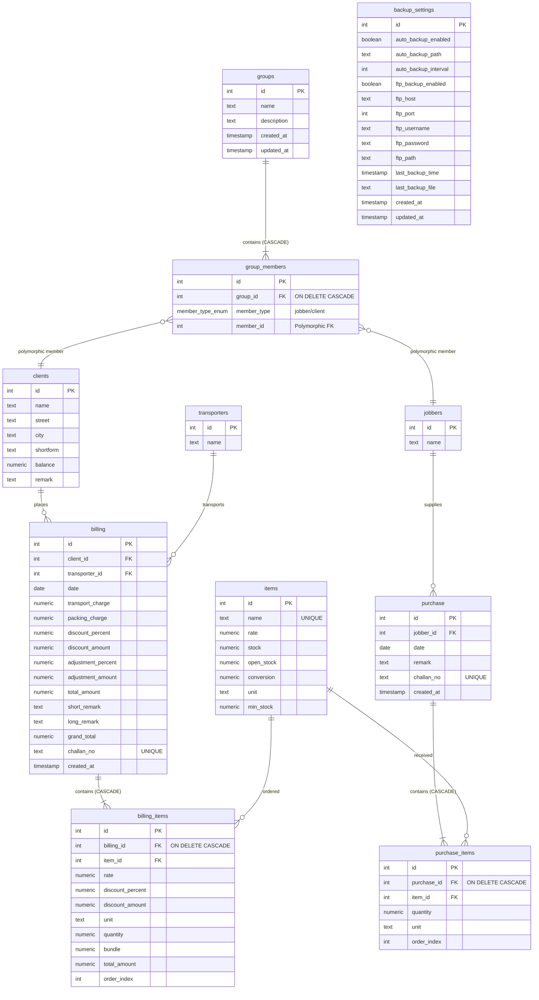

# HP Factory Management Suite - Database Schema Documentation

This document provides a detailed overview of the PostgreSQL relational database schema for the HP Factory Management Suite, explaining the tables, fields, relationships, and core database design patterns.

---

## 1. Entity-Relationship (ER) Diagram

The following diagram illustrates how the tables are physically and logically connected in the database:

---

## 2. Master Tables (Core Entities)

These tables store master records that do not change frequently and are referenced by transactional business operations.

### 2.1. `items` (Product Inventory)
Stores raw materials or finished products manufactured or stored in the factory.
* **`id` (SERIAL, PK)**: Unique identifier.
* **`name` (TEXT, UNIQUE)**: Unique name of the item (e.g., fabric types, sizes, codes).
* **`rate` (NUMERIC)**: Default billing/sales rate for the item.
* **`stock` (NUMERIC)**: The current available physical inventory. This is the **single source of truth** updated on transactions.
* **`open_stock` (NUMERIC)**: Opening stock count when the item was first registered.
* **`conversion` (NUMERIC)**: Standard conversion ratio for item bundling.
* **`unit` (TEXT)**: Default unit of measurement (e.g., `"MTR"`, `"PCS"`, `"KG"`).
* **`min_stock` (NUMERIC)**: Safety threshold for stock warnings.

### 2.2. `clients` (Customers)
Stores client information for outward billing and sales ledger tracking.
* **`id` (SERIAL, PK)**: Unique identifier.
* **`name` (TEXT)**: Legal name of the client.
* **`street` / `city` (TEXT)**: Billing and shipping address details.
* **`shortform` (TEXT)**: Used in generating sequence-based client challan numbers.
* **`balance` (NUMERIC)**: Current financial outstanding balance.
* **`remark` (TEXT)**: Custom notes/terms.

### 2.3. `jobbers` (Contractors / Goods Inward Parties)
Stores entities that perform contract job work (e.g., tailoring, processing, dyeing) or act as inward suppliers.
* **`id` (SERIAL, PK)**: Unique identifier.
* **`name` (TEXT)**: Name of the jobber/contractor.

### 2.4. `transporters` (Logistics Providers)
Logistics companies responsible for transporting finished goods to clients.
* **`id` (SERIAL, PK)**: Unique identifier.
* **`name` (TEXT)**: Name of the transporter.

---

## 3. Transactional & Business Tables

These tables record daily business transactions. They are relational and heavily index-optimized.

### 3.1. `billing` (Outward Sales Challans)
Records the parent invoice/challan information for products shipped to clients.
* **`id` (SERIAL, PK)**: Unique invoice ID.
* **`client_id` (INT, FK)**: References `clients(id)`. A bill must be linked to a valid client.
* **`transporter_id` (INT, FK)**: References `transporters(id)`. Optional transporter details.
* **`date` (DATE)**: Date of transaction (treated as timezone-safe string literal).
* **`total_amount` / `grand_total` (NUMERIC)**: Calculated totals before and after taxes, adjustments, and transport charges.
* **`challan_no` (TEXT, UNIQUE)**: Unique generated document serial number following formatting sequences (e.g., `<seq>/<MONTH>/<FY>`).

### 3.2. `billing_items` (Invoice Line Items)
Stores individual item rows linked to a parent `billing` record.
* **`id` (SERIAL, PK)**: Line item identifier.
* **`billing_id` (INT, FK)**: References `billing(id)` with `ON DELETE CASCADE`. If a bill is deleted, all its associated items are automatically purged.
* **`item_id` (INT, FK)**: References `items(id)`. Identifies the product sold.
* **`quantity` (NUMERIC)**: Number of units sold (deducts from `items.stock`).
* **`order_index` (INT)**: Preserves the stable UI line item sequence during updates and printing.

### 3.3. `purchase` (Goods Inward Challans)
Records materials received from jobbers/vendors.
* **`id` (SERIAL, PK)**: Unique inward challan ID.
* **`jobber_id` (INT, FK)**: References `jobbers(id)`.
* **`challan_no` (TEXT, UNIQUE)**: Unique inward receipt number.

### 3.4. `purchase_items` (Inward Line Items)
Stores line items for inward receipts.
* **`id` (SERIAL, PK)**: Line item identifier.
* **`purchase_id` (INT, FK)**: References `purchase(id)` with `ON DELETE CASCADE`.
* **`item_id` (INT, FK)**: References `items(id)`.
* **`quantity` (NUMERIC)**: Quantity received (increments `items.stock`).

---

## 4. Group System Tables (Polymorphic Ledger Grouping)

The group system allows grouping different business entities (clients and jobbers) together into unified reporting ledger units.

### 4.1. `groups` (Parent Groups)
* **`id` (SERIAL, PK)**: Parent group identifier.
* **`name` (TEXT)**: Custom name of the reporting group.

### 4.2. `group_members` (Polymorphic Membership Table)
This table resolves a **polymorphic many-to-many relationship**. A group can contain both `jobbers` and `clients`.
* **`group_id` (INT, FK)**: References `groups(id)` with `ON DELETE CASCADE`.
* **`member_type` (member_type_enum)**: Postgres Custom Enum containing either `'jobber'` or `'client'`.
* **`member_id` (INT)**:
  * **If `member_type` is `'client'`**: Connects to `clients.id`.
  * **If `member_type` is `'jobber'`**: Connects to `jobbers.id`.
* **Constraints**: Has a composite unique constraint `UNIQUE(group_id, member_type, member_id)` to prevent duplicate member enrollment inside a single group.

---

## 5. System Tables (Backup Configurations)

### 5.1. `backup_settings`
Manages the server's change-triggered database backup configurations.
* **`id` (SERIAL, PK)**: Hardcoded ID = 1 settings row.
* **`auto_backup_enabled` (BOOLEAN)**: Toggles automatic database backups on/off.
* **`auto_backup_path` (TEXT)**: Local directory path (defaults to `C:/NP-Backups/`).
* **`ftp_backup_enabled` (BOOLEAN)**: Toggles secondary remote FTP storage replication.
* **`ftp_host` / `ftp_username` / `ftp_password` / `ftp_path`**: Connection configurations for FTP uploads.
* **`last_backup_file` (TEXT)**: Record of the most recently created backup file (used for self-healing and retention cleanup).

---

## 6. Critical Schema Design Patterns

### 6.1. Stock Maintenance Logic (Single Source of Truth)
The database keeps a real-time running count of stock directly in the `items` table rather than calculating it dynamically on the fly via ledger scans:
* **Purchases**: Increment `items.stock`.
* **Bills (Challans)**: Decrement `items.stock`.
* **Edits / Deletes**: When a transaction is modified or deleted, the application reverses the old quantity changes from `items.stock` first before applying the new quantities or deleting the row, ensuring mathematical correctness inside SQL transaction blocks.

### 6.2. Stable Item Ordering
Line items in invoices (`billing_items` and `purchase_items`) use an `order_index` column. When a user drags/drops or inserts items in a specific order in the UI, that order is preserved by saving the indices, avoiding random table row reordering during subsequent database fetches.

### 6.3. Timezone-Safe Date Strings
The node-postgres database client is explicitly configured to parse DATE OID 1082 as a raw string literal (`YYYY-MM-DD`). This prevents PostgreSQL from automatically converting date variables based on the server's system timezones, eliminating "date-shifting" bugs (e.g., an invoice recorded on Oct 2nd appearing as Oct 1st due to GMT offset shifts).
