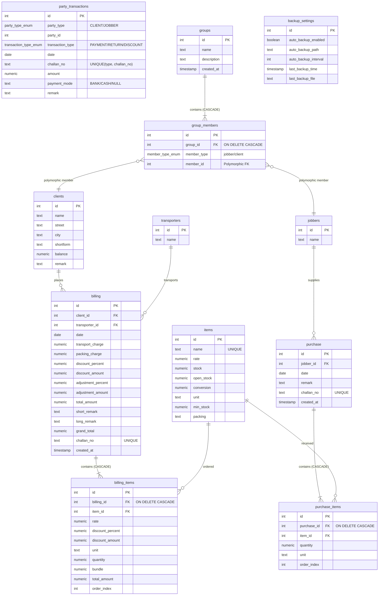

# HP Factory Management Suite - Complete Project Documentation

Welcome to the comprehensive technical documentation for the **HP Factory Management Suite**. This document serves as the ultimate developer guide to understanding the project's architecture, database schema, REST API design, frontend pages, and core business engineering rules.

---

## 1. Project Overview & Features

The **HP Factory Management Suite** is a full-stack ERP and accounting software designed to manage inventory, outward sales/billing, goods inward (purchases from contractors/job workers), payment transactions, ledger balances, and automated database backups.

### Core Features:
- **Inventory Tracking**: Real-time stock maintenance with safety threshold (minimum stock) alerts.
- **Sales & Outward Billing**: Full-featured billing module supporting transport and packing charges, line-item and overall discounts, adjustments, and automated inventory deduction.
- **Inward Job Work**: Logs goods received from contract workers (jobbers) and automatically increments stock levels.
- **Polymorphic Reporting Groups**: Dynamically groups clients and jobbers for consolidated ledger reporting.
- **Transaction & Outstanding Balance Ledger**: Tracks financial transactions (Payments, Returns, and Discounts) and computes outstanding client/jobber balances in real-time.
- **Price List Management**: Customized, categorized price list configuration for products.
- **Automated Backup & Restore**: Change-triggered database backups, local directory configurations, FTP replication, and database restore utilities.
- **Database Self-Healing**: Dynamic database schema initialization and background recovery of missing tables/indexes on startup or server table error events.

---

## 2. Architecture & Tech Stack

The application is designed as a monolithic-like structure containing two separate sub-folders for the client and server.

```
NP-Frontend (Root Workspace)
├── client/                     # Frontend SPA (React, Vite, Vanilla CSS)
├── server/                     # Backend API Server (Node.js, Express, PostgreSQL)
├── start.bat                   # Full package installer, compiler, and start script
└── start_moksh.bat             # Startup script for standard local development
```

### Technology Stack:
- **Frontend SPA**: Built with [React](https://react.dev/) using [Vite](https://vite.dev/) as the build tool. Styling is written in **Vanilla CSS** (located in custom styling systems under [`client/src/index.css`](file:///c:/Users/moksh/Videos/Projects/HP%20Factory/NP-Frontend/client/src/index.css)). Page routing and stateful navigation are handled by [`react-router-dom`](https://reactrouter.com/) (version 6).
- **Backend APIs**: Built using Node.js with the [Express.js](https://expressjs.com/) framework.
- **Database System**: Powered by [PostgreSQL](https://www.postgresql.org/), connected via the `pg` (`node-postgres`) pool client.
- **Deployment & Production Model**:
  - The React frontend compiles into a static asset build in `client/dist/` (`npm run build`).
  - The Express server acts as both the REST API provider and the static file host. It serves `client/dist` assets on the root path and fallbacks to `index.html` to support client-side React Router history.
- **Local Startup Process**: Running [`start_moksh.bat`](file:///c:/Users/moksh/Videos/Projects/HP%20Factory/NP-Frontend/start_moksh.bat) installs node modules for both components, compiles the frontend, starts the backend on port `5000` (binding to `0.0.0.0` for local network access), and automatically triggers the default browser to load the dashboard.

---

## 3. Database Schema

The database relies on a PostgreSQL schema designed with relational integrity, cascading deletions, composite unique indexes, and polymorphic ledger groupings.

### 3.1. Entity-Relationship (ER) Diagram



### 3.2. Table Breakdown

- **`items`**: Inventory items. Includes `stock` (physical count), `open_stock` (opening inventory), `min_stock` (alert threshold), and default transaction variables like `rate` and `unit`.
- **`clients`**: Customer entries containing addresses, opening balance defaults, and sequences code shortforms.
- **`jobbers`**: Sub-contractors or suppliers executing inward manufacturing work.
- **`transporters`**: Freight services selected at billing.
- **`billing` & `billing_items`**: Invoice headers and line items. Deleting a billing entry triggers a cascading deletion of its items.
- **`purchase` & `purchase_items`**: Inward challan records indicating batch intakes from jobbers. Deletions cascade to items.
- **`party_transactions`**: Stores transaction ledgers for Payments, Sales Returns, and Discounts.
- **`groups` & `group_members`**: Grouping entities that bundle jobbers and clients. Contains a custom Postgres enum `member_type_enum ('jobber', 'client')` mapping to the correct tables.
- **`backup_settings`**: Stores configuration parameters for database backups.
- **`price_lists`, `price_list_categories`, `price_list_items`**: Pricing structures grouped by customizable display orders and categories.

---

## 4. REST API Endpoint Catalog

The server runs on port `5000` (or `process.env.PORT`) with base URL `http://<IP>:5000/api`.

### 4.1. Master Endpoints (Searchable via `?search=term`)
- **Items**:
  - `GET /items` - List/search items.
  - `GET /items/:id` - Fetch specific item.
  - `GET /items/:id/transactions?from=...&to=...` - Fetch inward/outward history.
  - `POST /items` - Create item.
  - `PUT /items/:id` - Update item.
  - `DELETE /items/:id` - Secure delete (requires payload: `{"password": "VITE_DEL_PASS"}`).
- **Clients**:
  - `GET /clients` | `GET /clients/:id` | `POST /clients` | `PUT /clients/:id` | `DELETE /clients/:id` (requires deletion password).
- **Jobbers**:
  - `GET /jobbers` | `GET /jobbers/:id` | `POST /jobbers` | `PUT /jobbers/:id` | `DELETE /jobbers/:id` (requires deletion password).
- **Transporters**:
  - `GET /transporters` | `GET /transporters/:id` | `POST /transporters` | `PUT /transporters/:id` | `DELETE /transporters/:id` (requires deletion password).

### 4.2. Transactions & Operations Endpoints
- **Billing (Invoices)**:
  - `GET /billing` - List invoices (filterable by client, challan number, month, or date range).
  - `GET /billing/:id` - Invoice details.
  - `GET /billing/next-challan?date=YYYY-MM-DD[&id=...]` - Dynamic challan number preview.
  - `POST /billing` - Transaction-safe invoice creation.
  - `PUT /billing/:id` - Safe invoice replacement (reverts and reapplies stock).
  - `DELETE /billing/:id` - Deletion and stock recovery (requires password).
- **Purchase (Job Work)**:
  - `GET /purchase` | `GET /purchase/:id` | `GET /purchase/next-challan?date=...` | `POST /purchase` | `PUT /purchase/:id` | `DELETE /purchase/:id`.
- **Party Ledger Transactions**:
  - `GET /party-transactions` - Fetch transactions list.
  - `GET /party-transactions/outstanding?partyType=CLIENT/JOBBER&partyId=...` - Calculates outstanding ledger aggregates.
  - `GET /party-transactions/next-challan?date=...&transactionType=...` - Generates sequential transaction slip numbers.
  - `GET /party-transactions/:id` | `POST /party-transactions` | `PUT /party-transactions/:id` | `DELETE /party-transactions/:id`.
- **Groups**:
  - `GET /groups` | `GET /groups/:id` | `POST /groups` | `PUT /groups/:id` | `DELETE /groups/:id`.
- **Price Lists**:
  - `GET /price-list` - Returns categories and items.
  - `POST /price-list/categories` | `PUT /price-list/categories/:id` | `DELETE /price-list/categories/:id`.
  - `POST /price-list/items` | `PUT /price-list/items/reorder` | `DELETE /price-list/items/:id`.

### 4.3. System Utilities
- `POST /verify-login-pass` - Validates entry password stored in backend configuration.
- `GET /health` - Service health diagnostic.
- `GET /backup/settings` | `PUT /backup/settings` - Retrieve and save auto backup settings.
- `GET /backup/manual` - Downloads SQL backup file.
- `GET /backup/status` - Fetches timestamp and filename of latest auto backup.
- `POST /backup/restore` - Overwrites active schema with uploaded `.sql` dump file.

---

## 5. Frontend Pages & Routing Map

The client UI is managed by a router config in [`client/src/App.jsx`](file:///c:/Users/moksh/Videos/Projects/HP%20Factory/NP-Frontend/client/src/App.jsx). Most page layouts wrap the dynamic route contents inside a persistent sidebar and header layout ([`client/src/components/Layout.jsx`](file:///c:/Users/moksh/Videos/Projects/HP%20Factory/NP-Frontend/client/src/components/Layout.jsx)).

```
App Entry
└── AuthGuard (Login authentication check)
    └── BrowserRouter Routes:
        ├── /order-summary                                -> OrderSummary page (Homepage list of all outward transactions)
        ├── /dashboard                                    -> Dashboard page (Displays critical system metrics, low-stock notifications, backup details)
        ├── /stock-summary                                -> StockSummary page (Overview of item inventories)
        ├── /item-stock-details/:id                       -> ItemStockDetails page (Inward/outward movements table of an item)
        ├── /create-invoice                               -> CreateInvoice page (New invoice form)
        ├── /create-invoice/:id                           -> CreateInvoice page (Edit existing invoice form)
        ├── /job-work                                     -> JobWork page (List of job work/purchase orders)
        ├── /create-job-work                              -> CreateJobWork page (Add inward inventory from jobber)
        ├── /create-job-work/:id                          -> CreateJobWork page (Edit existing job work entry)
        ├── /payment                                      -> Payment page (List payment and transaction receipts)
        ├── /create-payment                               -> CreatePayment page (Add payment, return, or discount transaction)
        ├── /day-book                                     -> DayBook page (Aggregated ledger of all billing/purchases for a selected date)
        ├── /utility                                      -> Utility main panel
        │   ├── /utility/backup                           -> BackupManager page (Automatic/FTP settings and manual dump creation)
        │   └── /utility/restore                          -> RestoreManager page (Database restore system)
        ├── /master/
        │   ├── items                                     -> ItemList page (Manage product catalog)
        │   ├── party-list                                -> PartyList page (Manage clients)
        │   ├── jobber                                    -> JobberList page (Manage job workers)
        │   ├── groups                                    -> GroupList page (Manage reporting group associations)
        │   ├── transporters                              -> TransporterList page (Manage transport logistics)
        │   └── price-list                                -> PriceList page (Manage custom pricing arrays)
        └── /reports/
            ├── (Dashboard)                               -> ReportsDashboard page (Launch pad for reports)
            ├── party-stock                               -> PartyStockReport page (Aggregated stock issued to clients)
            ├── party-stock-detail/:clientId/:itemId       -> PartyStockDetail page (Detailed client-item movement ledger)
            ├── party-sales                               -> PartySalesReport page (Sales totals per client)
            ├── group-sales                               -> GroupSalesReport page (Revenue aggregated by group)
            ├── party-billing-detail/:clientId            -> PartyBillingDetail page (Client challan invoice list)
            ├── job-work                                  -> JobWorkReport page (Job work quantities issued)
            ├── job-work-detail/:jobberId/:itemId         -> JobWorkDetail page (Jobber-item transaction ledger)
            ├── detail-job-report                         -> DetailJobReport page (Chronological inward items table)
            ├── job-summary                               -> JobSummaryReport page (Total job work quantity per item/jobber)
            └── item-sold-summary                         -> ItemSoldSummary page (Sales volume by item)
```

---

## 6. Key Technical & Business Mechanisms

This project implements several unique and highly robust systems to ensure data consistency, performance, and recoverability.

### 6.1. Real-Time Stock Maintenance
Unlike systems that compute current inventory dynamically by scanning massive historical tables, the database maintains inventory counts directly inside `items.stock` as a **single source of truth**. Stock is updated transactionally:
- **Billing Outflow**: Decrements `items.stock`.
- **Purchase Inflow**: Increments `items.stock`.
- **Safe updates & deletions**: When editing an invoice or job work entry, the server runs a SQL transaction that first **reverts** the old quantities associated with the document from `items.stock`, and then applies the new quantities. This eliminates math drift issues during updates.
- **Master Adjustments**: Modifying an item's opening stock (`open_stock`) calculates the delta and applies it to the active stock.

### 6.2. PostgreSQL Date Precision & Timezone Safety
By default, the `node-postgres` driver converts database values to JavaScript dates, automatically shifting dates based on the server's running timezone. This can cause "date shifting" (e.g. an invoice recorded on Oct 2nd appearing as Oct 1st on screens located in different timezones).
- **Solution**: The system configures the database driver to parse DATE OID `1082` as a raw string literal. Dates are saved, stored, and loaded as raw `"YYYY-MM-DD"` strings, completely bypassing timezone modifications.

### 6.3. Sequential Challan Code Generation
Both billing/purchases and payment transactions generate sequential, monthly-resetting document codes:
- **Format**:
  - Invoices: `<sequence>/<MONTH>/<FY>` (e.g., `103/JAN/26-27`)
  - Purchases: `P<sequence>/<MONTH>/<FY>` (e.g., `P103/JAN/26-27`)
  - Payments/Returns: `<sequence>/<MONTH>/<FY>` (e.g., `12/JAN/26-27`)
- **Sequence Rules**: Sequences automatically reset on the 1st of every month. The financial year (`FY`) increments on April 1st.
- **Safe Concurrency**: To prevent dual clients from receiving duplicate sequence numbers when making simultaneous submissions, the server runs an SQL transaction that locks the target tables in `SHARE ROW EXCLUSIVE MODE` during generation.

### 6.4. Automatic DB Self-Healing
If the database table structure is compromised (e.g., table drop or bad migrations), any API call that hits a "missing table/relation" database error (`code 42P01`) triggers the server error-handler middleware to run the auto-healer:
- It parses the SQL schema from [`server/db.md`](file:///c:/Users/moksh/Videos/Projects/HP%20Factory/NP-Frontend/server/db.md).
- It executes each table/index creation statement individually.
- Statements that reference existing structures are caught and skipped, while missing tables, indexes, or custom types are re-created in the background.

### 6.5. Automatic Mutation-Triggered Backups
The server listens for any successful database mutations (`POST`, `PUT`, `DELETE` requests) in `app.js` using response middleware. 
- If a data-changing HTTP request finishes successfully, the server runs a background auto-backup service.
- The service exports a database dump to the local directory (default: `C:/NP-Backups/`) according to intervals configured in the `backup_settings` table.
- **Self-Healing Backups**: On server startup, the backup scheduler verifies that a default settings row exists. If no backup file is found on disk (or is deleted), the server runs a background backup job to rebuild it.

### 6.6. Client Balance Formulas
Financial outstanding balances are tracked in real-time.
- **Clients**:
  $$\text{Current Balance} = \text{Opening Balance} + \text{Total Bills} - \text{Total Payments} - \text{Total Returns} - \text{Total Discounts}$$
- **Jobbers**: Job workers start with a baseline of zero since their raw services do not carry billing amounts:
  $$\text{Current Balance} = 0 - \text{Total Payments} - \text{Total Returns} - \text{Total Discounts}$$

### 6.7. Data Sanitization Rules
To maintain clean reports and searchable listings, the server runs an interceptor ([`server/utils/dataSanitizer.js`](file:///c:/Users/moksh/Videos/Projects/HP%20Factory/NP-Frontend/server/utils/dataSanitizer.js)) that automatically sanitizes inputs:
- All text strings (Names, remarks, transport details, units) are transformed into **`UPPERCASE`** before writing to the database.

---

## 7. Configuration & Setup

### Environment Variables (`server/.env`)
Create a `.env` file under the `/server/` directory containing the following:
```ini
DB_USER=postgres
DB_HOST=localhost
DB_PASSWORD=your_postgres_password
DB_NAME=hp_factory
DB_PORT=5432
PORT=5000
login_pass=ADMIN     # Password required to unlock the secure entry gate of the web interface
VITE_DEL_PASS=DELETE  # Password required to delete critical database assets (items, clients, bills)
```

### Installation and Bootup:
1. Ensure **PostgreSQL** is running on your machine on port `5432`.
2. Run [`start_moksh.bat`](file:///c:/Users/moksh/Videos/Projects/HP%20Factory/NP-Frontend/start_moksh.bat) (or `start.bat` depending on directory layout).
3. The script will install dependencies, build client files, run database checks (auto-creating `hp_factory` and running schema definitions if missing), boot the API server, and launch the web app.
